# π-plotter — User manual

*Dr. T. Francese*

π-plotter turns almost any data file into a publication-quality figure and analyses it with open-source Python modules (NumPy, SciPy, statsmodels, Matplotlib…), all in your browser and all on your own computer. This manual follows the order in which you work: **open the data → choose what to plot → style the figure → analyse (fit, peaks, statistics…) → export**. Every step has a picture taken from the program itself.

> **Tip:** the manual is available at any time from the **Manual** button in the top bar. It opens in a new tab, so you can keep it beside the program. The interface itself is in English and Italian (**EN / IT** in the top bar); this manual is in English.

## 1. Before you start

### 1.1 Starting π-plotter

1. Install **Python 3.10 or newer** once ([python.org/downloads](https://www.python.org/downloads/)).
2. Start the program:
  - **macOS**: double-click `start_piplotter.command` (the first time: right-click › **Open** › **Open**).
  - **Windows**: double-click `start_piplotter.bat`.
  - **Linux** or any system: `python3 start_piplotter.py`.
3. A terminal window opens and your browser shows π-plotter at `http://127.0.0.1:8770`. **Keep the terminal window open** while you work; `Ctrl+C` in it stops the program.
4. The very first time, the page offers to install NumPy, pandas and Matplotlib (about 80 MB). Press **Install and start**; one progress bar shows the progress. They go into π-plotter's private environment (the `.venv` folder), never into your system Python.

Everything runs on your computer: the service listens on `127.0.0.1` only, and your files never leave it. Only the installation of modules (from PyPI) uses the internet.

### 1.2 The main window

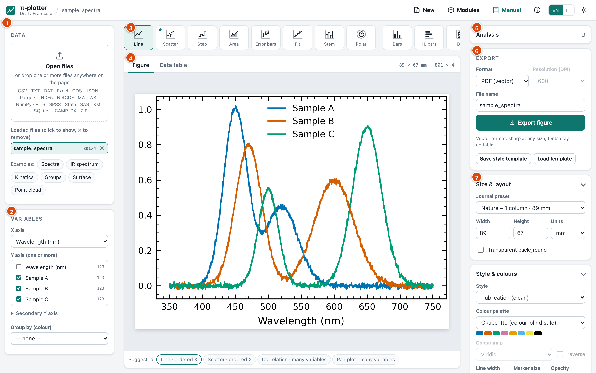

The window has three columns:

| Number | Area | What it is for |
|---|---|---|
| 1 | **Data** (left) | Open files, example data sets, the list of loaded files, import options. |
| 2 | **Variables** (left) | Which column is X, which are Y, error columns, grouping, how several files are combined. |
| 3 | **Plot types** (top centre) | A bar of 27 plot types; the program suggests one (★). |
| 4 | **Figure / Data table** (centre) | The figure as it will be exported; a second tab shows the data. Tabs for analysis results appear next to them. |
| 5 | **Analysis** (right) | Choose an analysis, set its parameters, run it, read the numbers. |
| 6 | **Export** (right) | Format, resolution, file name. |
| 7 | **Size & layout, Style & colours, Series, Text & fonts, Axes & ticks, Legend** (right) | Everything that changes the look of the figure. |

In the top bar: **New** starts a new analysis (it closes data, figure and results but keeps your style), **Modules** manages the Python modules, **Manual** opens this manual, **ⓘ** shows licences and what to cite, **EN / IT** switches language, and the sun/moon button switches between light and dark mode.

## 2. Step 1 — Open your data

### 2.1 Open a file

Press **Open files** in the *Data* card, or simply **drop one or more files anywhere on the page**.

 and the Variables card (bottom). The loaded file appears in the list with its size: 801 rows × 4 columns.")

π-plotter reads CSV, TSV, TXT and DAT (separator, decimal comma, header, comment lines and text encoding are detected automatically), Excel (`.xlsx`, `.xls`), LibreOffice `.ods`, JSON, Parquet, Feather, ORC, HDF5, NetCDF, MATLAB `.mat`, NumPy `.npy/.npz`, FITS, SPSS, Stata, SAS, XML, HTML tables, SQLite, **JCAMP-DX spectra** (`.jdx`, `.dx`) and ZIP or compressed files (`.gz`, `.bz2`, `.xz`).

* If a format needs an optional module (for example `openpyxl` for Excel), a small window offers to install it, with a progress bar. Press **Install**; when it has finished the file can be opened.
* A file with several tables (Excel sheets, HDF5 datasets, SQLite tables…) shows a **Table / sheet / dataset** list under the examples: choose the one you want.
* The list **Loaded files** shows each file with its rows × columns. Click a name to show that file; click **✕** to remove it.

> **Tip — no data at hand?** The **Examples** buttons (*Spectra, IR spectrum, Kinetics, Groups, Surface, Point cloud*) load small synthetic data sets. All the pictures in this manual use them, so you can repeat every step exactly.

### 2.2 When the file is not read correctly

Open **Import options** (it appears under the examples for text files).

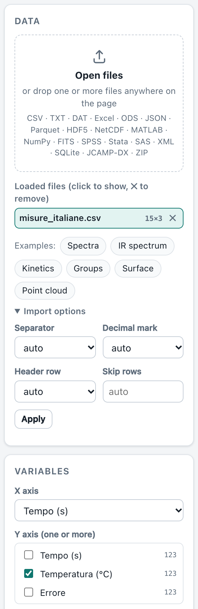

1. Change **Separator** (comma, semicolon, tab, bar, spaces) and **Decimal mark** if the columns are wrong.
2. Set **Header row** (or *none*) and **Skip rows** if the file starts with notes.
3. Press **Apply**.

If numbers with thousands separators are found (for example `1,234.5`), π-plotter asks whether to **Convert to numbers**; otherwise those rows would be missing from numeric plots.

### 2.3 Look at the data

The **Data table** tab shows the first rows with the type of each column (`float64`, `int64`, text, date…). Check here that numbers are numbers.

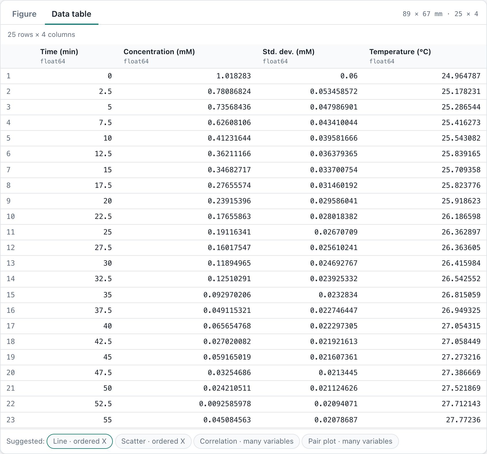

### 2.4 Several files at once

Open (or drop) several files together and they are drawn in **the same graph**, one colour and one legend entry per file. The **Combine files** section of the *Variables* card lets you choose which files, columns and error columns to include, or switch to **One panel per file**.

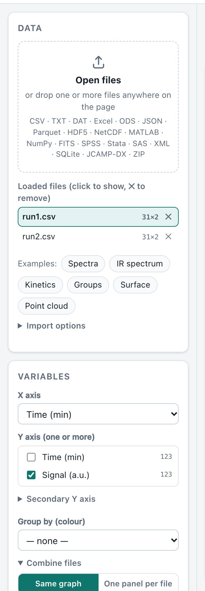

, (b): ready for a multi-panel journal figure.")

### 2.5 Very wide tables

Tables with thousands of columns (spectra series, for instance) are fine: every list of columns has **All / None**, a filter that also accepts a range of numeric names (`19600-19840`) or of positions (`#1-500`), and Shift+click ticks a whole block. A heat map draws all columns; a correlation matrix accepts up to 2,000 columns.

## 3. Step 2 — Choose the variables and the plot type

### 3.1 Variables

, Secondary Y axis, Group by (colour).")

* **X axis** — the column on the horizontal axis.
* **Y axis (one or more)** — tick every column to draw. Each becomes a series with its own colour.
* **Secondary Y axis** — columns drawn against a second axis on the right (for example temperature and concentration in the same plot).
* **Group by (colour)** — a text column whose values split the data into coloured groups.
* **X error / Y error** — appear for plot types that can draw error bars; choose the column that holds the uncertainties (columns called `err`, `std`, `sigma`, `errore`… are recognised automatically).

### 3.2 Plot types


The bar offers **27 plot types**: line, scatter, step, area, error bars, fit (with equation and R²), stem, polar, bars, horizontal bars, box, violin, strip, swarm, pie, histogram, density, ECDF, heatmap, contour, hexbin, 2D histogram, correlation matrix, pair plot, and three **3D** types (surface, 3D scatter, waterfall).

The program looks at the types of your columns and **suggests** the right plot: a ★ marks the first choice and the **Suggested** buttons under the figure give a few alternatives. A time series becomes a line plot, a point cloud a scatter (or hexbin if there are many points), categories become bars or boxes, X-Y-Z grids contour or heat maps.

> **Tip:** if the figure looks wrong, check the **Variables** card first: usually a column is ticked that should not be (the X column, a counter, an error column).

## 4. Step 3 — Make the figure look right

All the controls are in the right column. The figure is redrawn at once; it is always drawn at its **real physical size**, so what you see is what the journal will print.

### 4.1 Size, style, colours, series

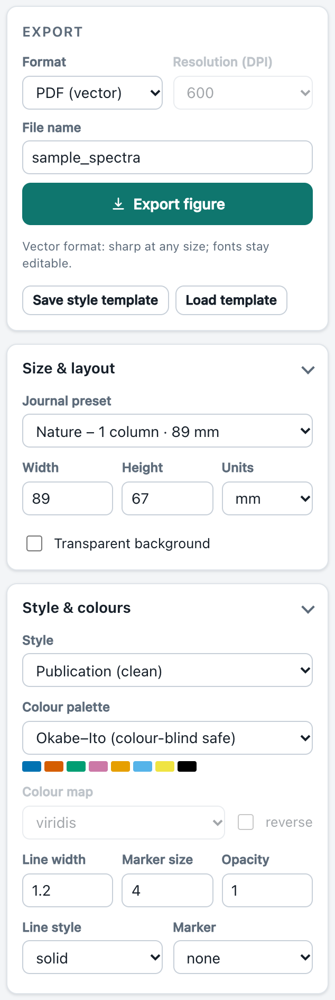

* **Size & layout** — choose a **Journal preset** (Nature, Science, ACS, Elsevier, RSC, APS, IEEE, thesis page, slide, poster panel…) or type **Width** and **Height** in mm, cm or inches. A transparent background is one tick away.
* **Style & colours** — the **Style** (clean publication, white grid, ggplot, Science / Nature-like / IEEE-like from SciencePlots…), the **Colour palette** (Okabe–Ito and Tol are colour-blind safe) and, for heat maps and surfaces, the **Colour map**. Line width, marker size, opacity, line style and marker are set here for all series.

, label, line style, marker and width. *reset* returns to the automatic values.")

* **Series** — change the colour, legend label, line style, marker and width of **one** series. The colours of this card are exactly those of the figure.

> **Note:** journal names in the presets only describe column widths. They are trademarks of their owners, who are not affiliated with π-plotter.

### 4.2 Text, axes, legend

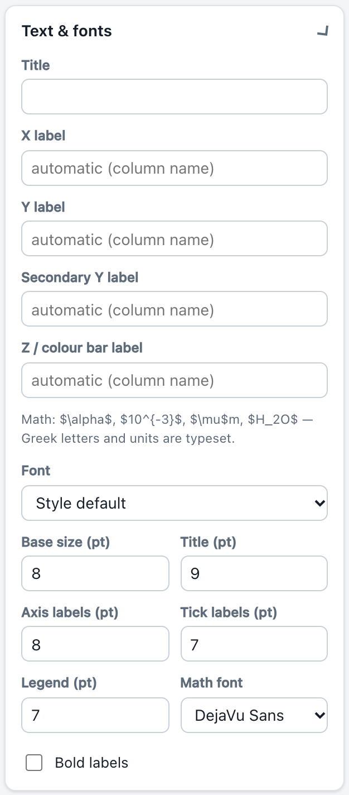

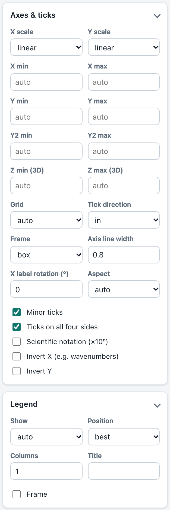

* **Text & fonts** — title and axis labels (by default the column names), the font and the sizes **in points**. Formulas go between dollar signs: `$\alpha$`, `$10^{-3}$`, `$\mu$m`, `$H_2O$`.
* **Axes & ticks** — linear, log or symlog scales; X/Y limits (empty = automatic); grid; tick direction, minor and mirrored ticks; frame; scientific notation; **Invert X** (for wavenumbers, which are read from high to low).
* **Legend** — shown automatically, always or never; position (also outside the axes); columns; title; frame.

### 4.3 Zoom, move and rewrite directly on the figure

* **Zoom**: drag a box on the figure, or turn the mouse wheel. The axes are redrawn for the new range, not just magnified. Shift+wheel or a thin box zooms one axis only. **↶ Previous zoom** goes back one step, **⤢ Whole figure** shows everything (double-click on the plot does the same).

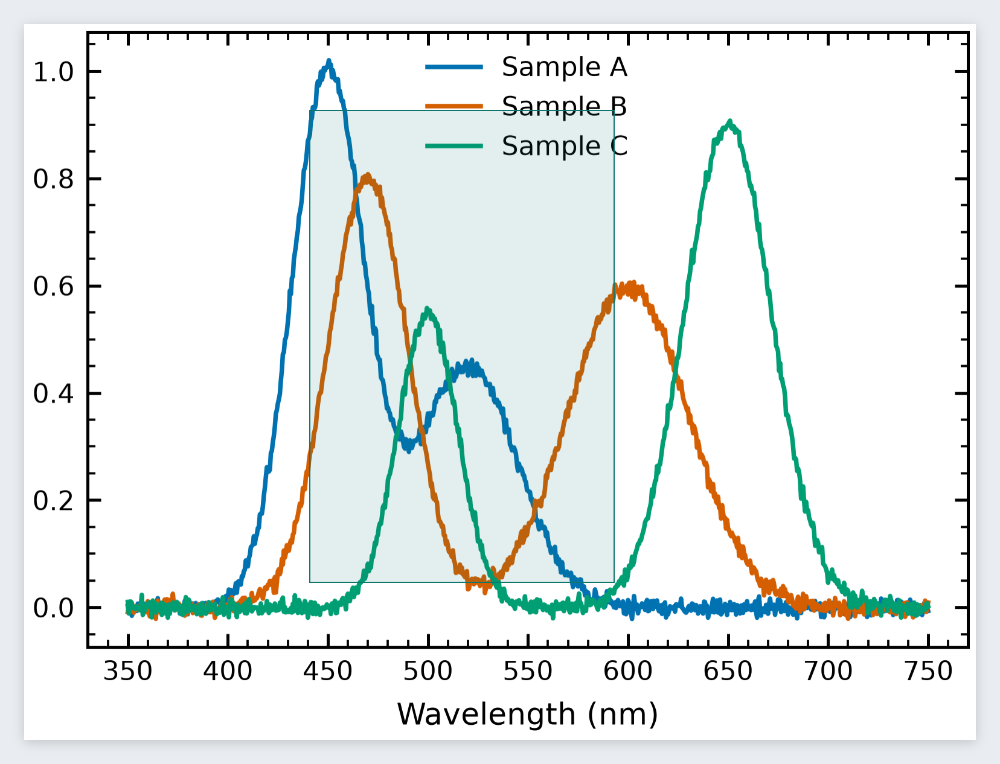

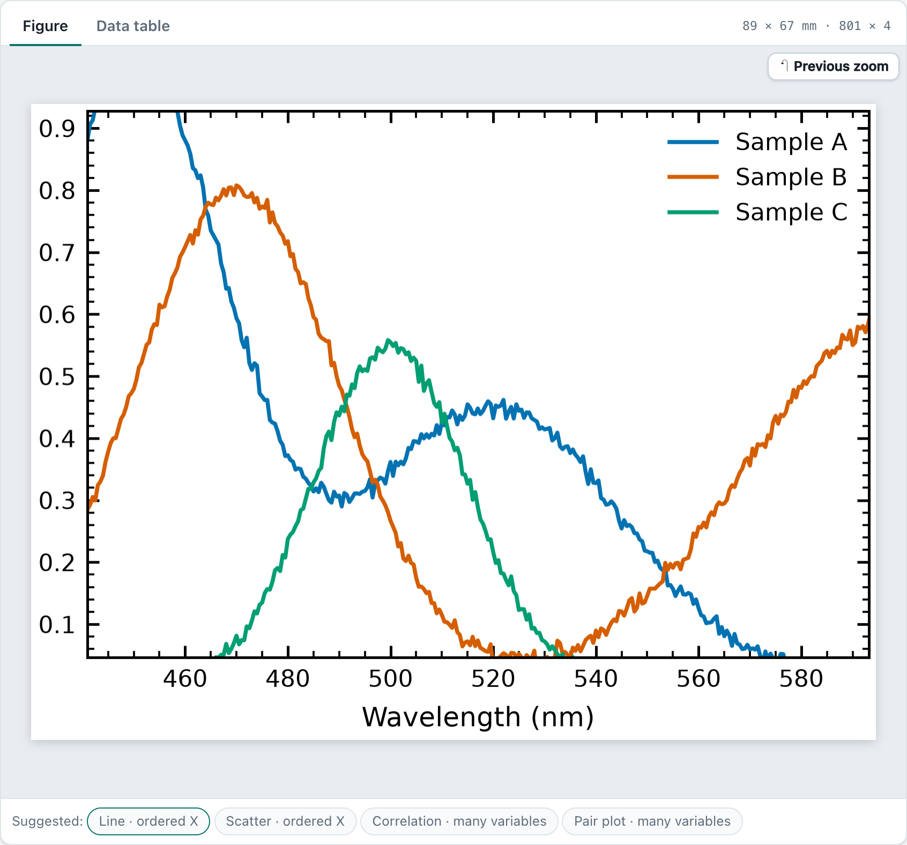

* **Move texts**: drag the title, an axis label, the legend, the colour-bar label, a pie slice label or a peak label to a new place.
* **Rewrite texts**: double-click a text, type the new one (formulas between `$…$`) and press Enter. *Original text* and *Original position* restore the automatic ones.

Zoom, moved and rewritten texts are kept in every export.

### 4.4 Three-dimensional figures

The 3D types are **surface** z(x, y) (from a regular grid or from scattered points, optionally as a wire frame), **3D scatter / line** and **waterfall** of spectra (one curve per column, at the depth given by the column name, such as a time or a temperature).

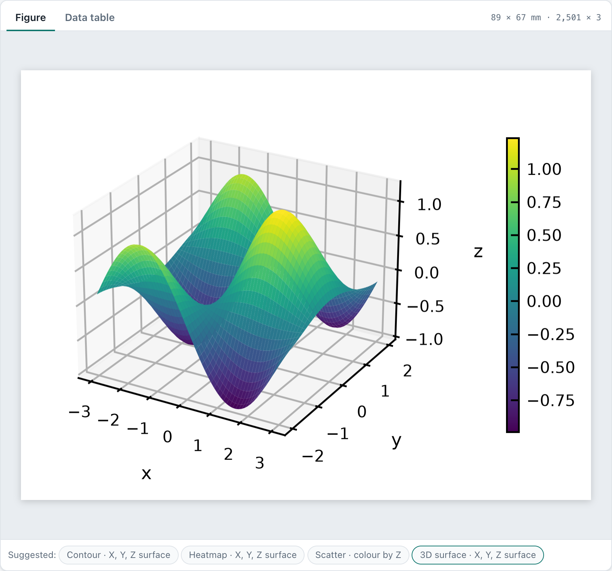

**Drag the figure to rotate it**: a light copy of the data turns smoothly in the page; when you release, the angles are kept and the figure is drawn again with Matplotlib. Double-click returns to the default view. The view angles and the Z limits are also in the *Axes & ticks* card.

### 4.5 Style templates

**Save style template** (in the *Export* card) writes all the style settings to a small JSON file; **Load template** applies it to any other figure. Use it to give a whole paper the same look.

## 5. Step 4 — Analyse the data

### 5.1 How the Analysis panel works

The **Analysis** card is at the top of the right column. The same five steps work for every analysis:

1. **Choose the analysis** from the list.
2. **Set the parameters** (columns, model, limits…). The columns are proposed from your variables.
3. Press **Run analysis**.
4. **Read the results** under the button: a summary table, tables of parameters, plain-language sentences, and the **references to cite**. *Copy* and *CSV* export any table.
5. Look at the result on the figure with **Show on a copy of the figure**, or open a result that has its own axes (autocorrelation, power spectrum, Q–Q plot…) with **Plot the result**.

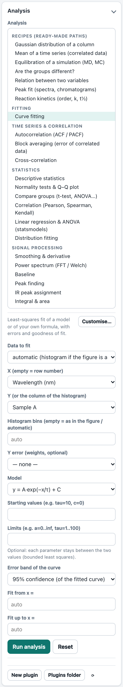

> **Note:** **your original figure is never modified.** Analysis curves are drawn on a *copy*, in a tab next to *Figure* (close it with **×**). Analyses you run while a copy is open are added to that copy, which has its own style and exports like any figure. **← Back to the original figure** returns to the data.

The analyses are grouped as:

| Group | Analyses |
|---|---|
| **Recipes** | Gaussian distribution of a column · Mean of a time series · Equilibration of a simulation · Are the groups different? · Relation between two variables · Peak fit · Reaction kinetics |
| **Fitting** | Curve fitting |
| **Time series & correlation** | Autocorrelation (ACF / PACF) · Block averaging · Cross-correlation |
| **Statistics** | Descriptive statistics · Normality tests & Q–Q plot · Compare groups · Correlation · Linear regression & ANOVA · Distribution fitting |
| **Signal processing** | Smoothing & derivative · Power spectrum · Baseline · Peak finding · IR peak assignment · Integral & area |

**Recipes** are the easy way in: each one chains several analyses, chooses sensible defaults and answers in plain words. If you are unsure, start from a recipe.

Every analysis uses established open-source modules (SciPy, statsmodels) and gives you the **references to cite** with the results.

### 5.2 Fitting a curve — worked example (kinetics)

Goal: fit a decay to the concentration of a reactant and obtain the lifetime with its error.

1. Press **Examples › Kinetics**. In the *Variables* card keep **Time (min)** as X and tick only **Concentration (mM)** as Y. Choose the plot type **Error bars** and, as **Y error**, **Std. dev. (mM)**.
2. In *Analysis* choose **Curve fitting**.

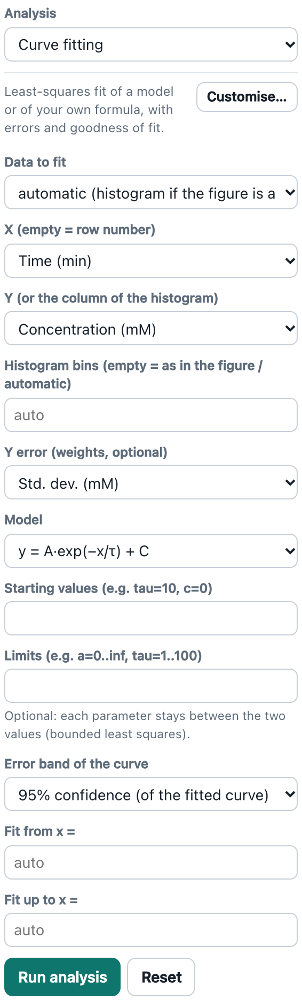

3. Set **Y error (weights, optional)** to **Std. dev. (mM)**: points with a larger error then count less.
4. Choose the **Model**: exponential (also double and stretched/KWW), power, Gaussian, Lorentzian, Voigt, logistic, Hill, Michaelis–Menten, Arrhenius, sine, polynomials — or write **your own formula** in x, for example `a*exp(-x/tau) + c`. Here: `y = A·exp(−x/τ) + C`.
5. Optional: give **Starting values** (`tau=10, c=0`) and **Limits** (`a=0..inf, tau=1..100`) if the fit does not converge; choose the **Error band** (95 % confidence of the curve, prediction band, or none); restrict the range with **Fit from x =** and **Fit up to x =**.
6. Press **Run analysis**.

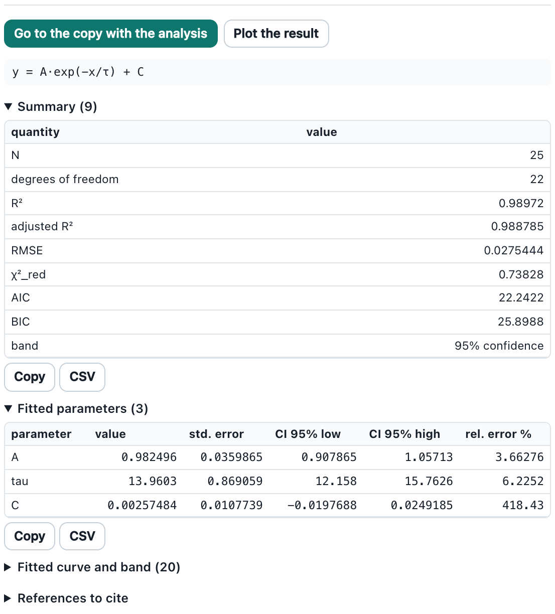

How to read it:

* **R², adjusted R², RMSE, χ²_red** tell how well the curve describes the data (χ²_red close to 1 means that the scatter agrees with the error bars you gave); **AIC** and **BIC** let you compare models — the lower, the better.
* **Fitted parameters** lists value, standard error, 95 % confidence interval and relative error. Here τ comes out close to 14 min, the value used to generate the example.

7. Press **Show on a copy of the figure** to draw the curve and its error band over your data.

. The original figure is untouched.")

> **Tip:** *Curve fitting* also fits the **histogram of a column** (for example a Gaussian over a distribution of values): use **Data to fit** to choose the histogram of the column (it is picked automatically when the figure is a histogram) and, if you want, the number of **Histogram bins**.

### 5.3 Reaction kinetics in one click

The recipe **Reaction kinetics (order, k, t½)** fits zero-, first- and second-order laws to the same data, compares them with the AIC, and gives the best order, the rate constant *k* and the half-life with errors. Choose time as X, the concentration as Y (and its error column as *Error of y*) and press **Run analysis**.

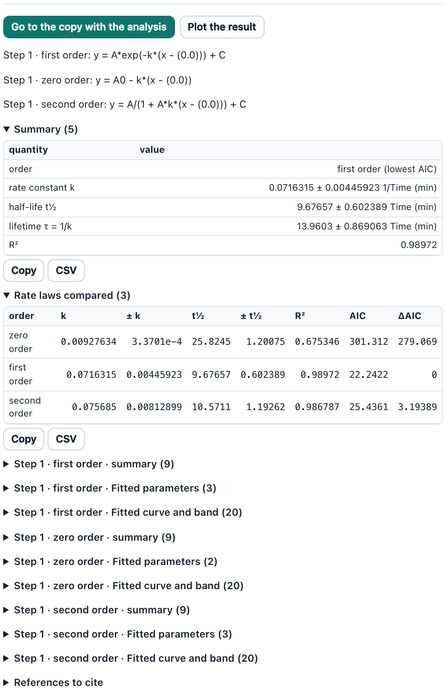

 on a copy of the figure.")

### 5.4 Spectra and chromatograms: baseline → peaks → peak fit → area

For any signal with peaks (UV-Vis, IR, Raman, XRD, chromatograms…) work in this order: **baseline first, then the analysis**.

#### Step 1 — Baseline

Choose **Baseline**. By default the program draws a **straight line under the signal**; you can also click the anchor points yourself, or choose a method that follows a curved background.

, and the direction of the peaks recognised from the signal.")

* **Automatic: straight line under the signal (or polynomial)** — the default. The line is fitted to the points that lie on the baseline; points higher than the line by more than three times the noise (the peaks) do not pull it up (Mazet et al., 2005). **Shape** sets how it may bend: **0** a flat, constant level; **1** a straight line (the default); **2–6** a gently curved polynomial for backgrounds that bend. Where the signal has no peaks, the corrected signal is flat at zero.
* **Anchor points (click on the figure)**: press **Pick on the figure** and click where the signal lies on its baseline, between and around the peaks; press **Esc** or **Done** when finished (**Remove last** and **Clear** correct mistakes). **Each click keeps its x and its y**, so the point stays exactly where you clicked (the text box shows `x y`, one point per line). A point written with **x alone** takes the height of the signal there. Choose whether the points are joined by straight lines or by a smooth curve.
* **Automatic methods that follow curved backgrounds**: *arPLS*, *asymmetric least squares*, *SNIP* or *rubber band*. Change **Stiffness** (lower follows the signal more) or **Asymmetry** if the line climbs into broad peaks.
* **The peaks point**: up (absorbance, counts, intensity) or down (transmittance, dips). With **recognise from the signal** the program decides from the shape of the data: for a transmittance spectrum like the example the baseline is drawn **above** the dips, along the top of the spectrum.

Press **Run analysis** and then **Show on a copy of the figure**: you see the data, the baseline and the corrected signal (signal − baseline). The results say which way the peaks point and how many points lie on the wrong side of the baseline; above 5 % the program warns that the line cuts into the signal there.

 runs along the top of the spectrum, above the dips; the corrected signal (below) is flat at zero between the bands.")

*Peak finding*, *Peak fit* and *Integral* then offer the same baseline already selected, so heights, widths and areas are measured **above it**.

#### Step 2 — Peak finding

Choose **Peak finding**. It finds peaks by **prominence** (use **Minimum prominence** to ignore noise; empty means 5 % of the range) and reports position, height, FWHM and area above the baseline. Use **Only from x / to x** to restrict the range, or **Find minima instead** for dips. The **position is written above each peak**; crowded labels move aside with a leader line.

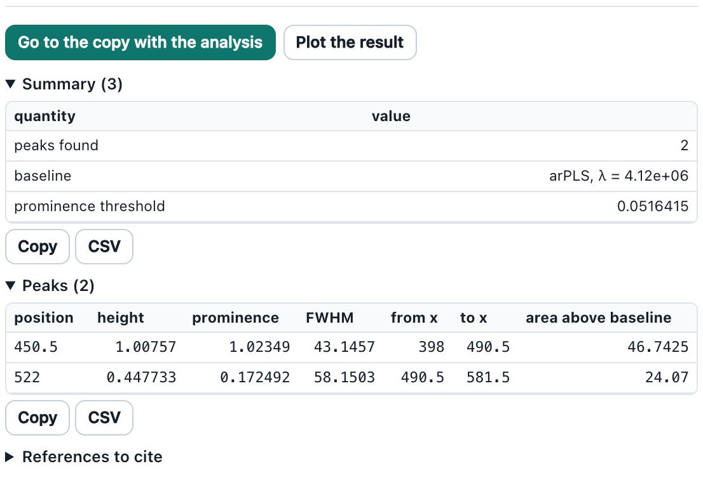

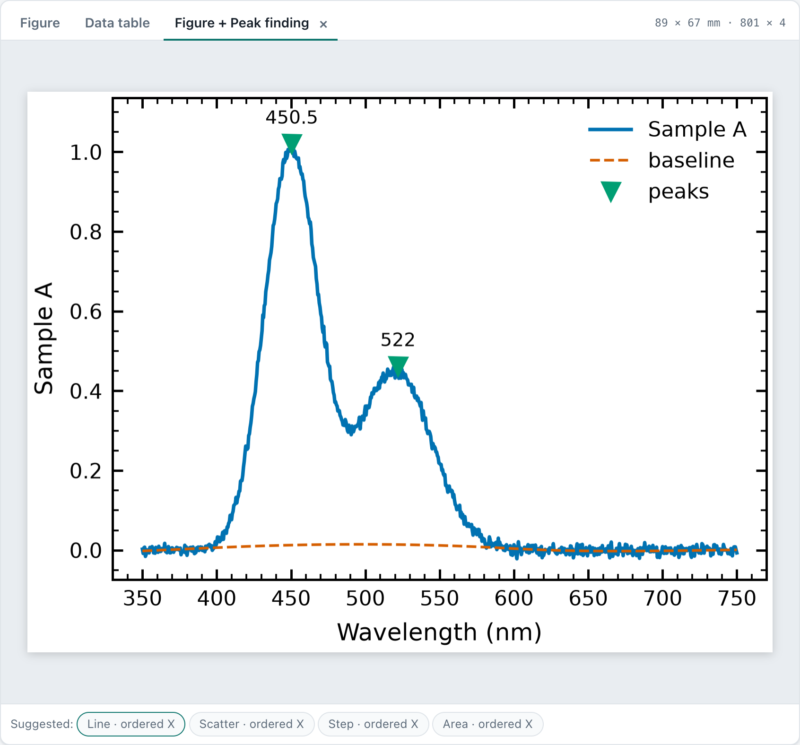

#### Step 3 — Peak fit

The recipe **Peak fit (spectra, chromatograms)** finds the peaks and **fits them all together** with Gaussian or Lorentzian shapes (**Peak shape**): centre, height, FWHM and area of each peak, with errors. Each peak stays inside its own region. As **Baseline** you can also choose a straight line or a constant fitted together with the peaks.

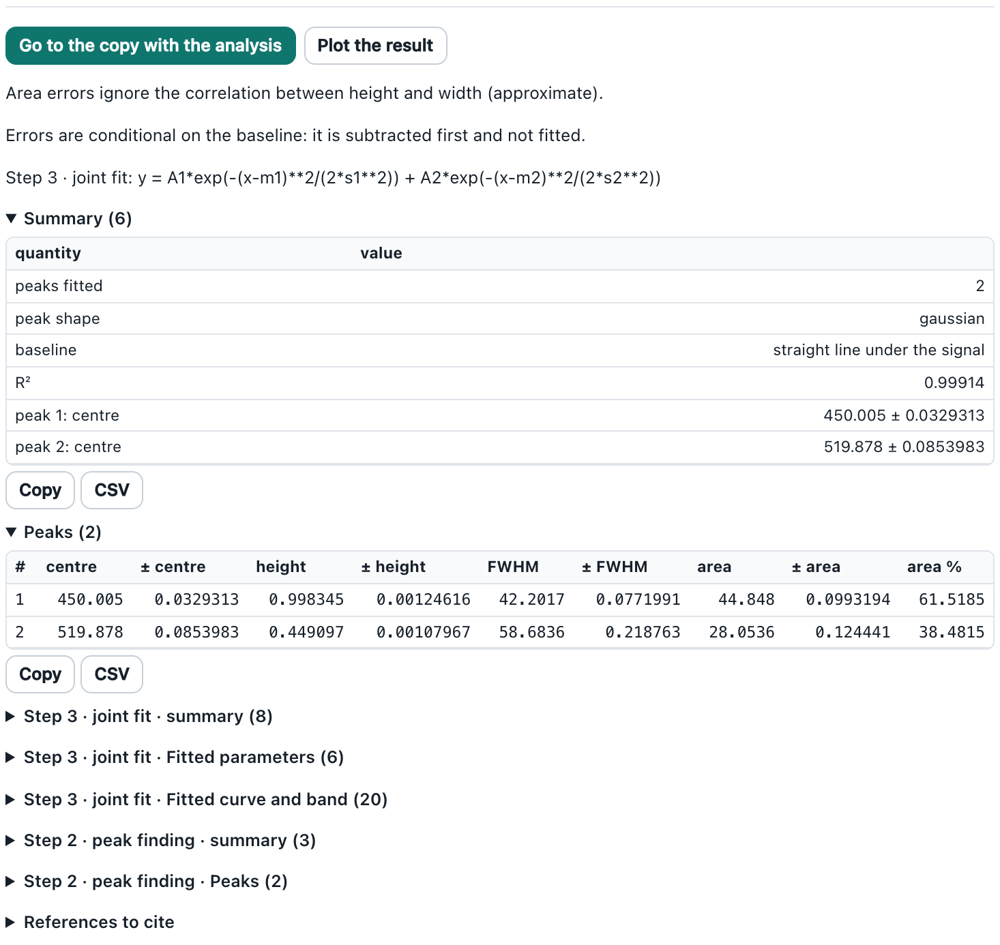

, the individual peaks (dotted) and the peak positions above them.")

> **Note:** the area errors ignore the correlation between height and width (they are approximate), and errors are conditional on the baseline, which is subtracted and not fitted.

#### Step 4 — Integral

**Integral & area** gives the area under the curve between two x values (**From x / To x**) and the cumulative integral, optionally above the same baseline.

### 5.5 IR peak assignment

On a mid-infrared spectrum (absorbance or transmittance; wavenumber in cm⁻¹, or wavelength in µm or nm) **IR peak assignment** finds the peaks and lists for each the **candidate groups** from a table of about 110 characteristic bands: organic groups, and inorganic anions and minerals (carbonates, sulfates, silicates, oxalates…) for materials and conservation science.

1. Press **Examples › IR spectrum**, or open your own spectrum.
2. Choose **IR peak assignment**. The program recognises transmittance or absorbance and the unit by itself (**The spectrum is**, **X unit** = *auto*); change them if needed.
3. **Compare with** chooses the table: *all the table*, *organic groups* or *inorganic anions and minerals*; **Organic groups with** is *C, H, O, N only* unless you choose *also S, P, Si, halogens*.
4. Press **Run analysis**, then **Show on a copy of the figure**.

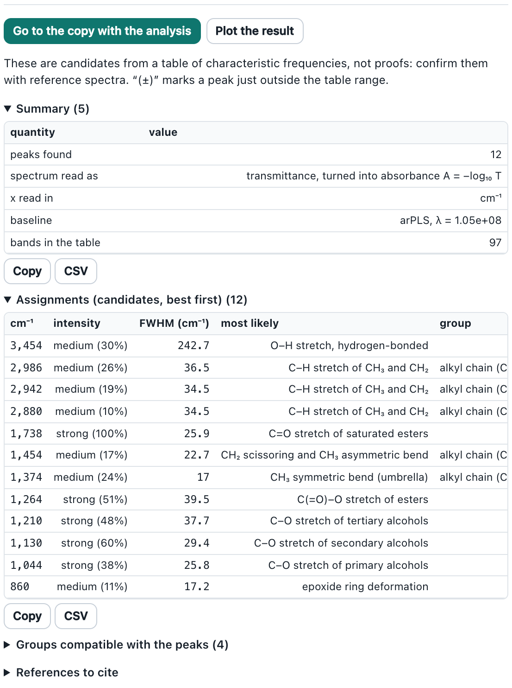

.")

The candidates are ranked by band range, intensity and width, and by the other bands the same group needs: an ester C–O only with an ester C=O, an aryl ether only with an aromatic ring, organic groups only with C–H bands.

> **Important:** these are **candidates, not proofs**. Confirm with reference spectra. The table of bands (`BANDS` in `piplotter/analyses/ir_assign.py`) can be edited with **Customise…**; its sources are listed in `REFERENCES.md`.

### 5.6 Simulations and time series

#### Equilibration of a simulation (MD, Monte Carlo)

For a trajectory (energy, density, RMSD…) the recipe **Equilibration of a simulation** finds automatically **where the series is equilibrated** and gives the average of the equilibrated part **with its true error**. Choose the series (and the time column) and press **Run analysis**.

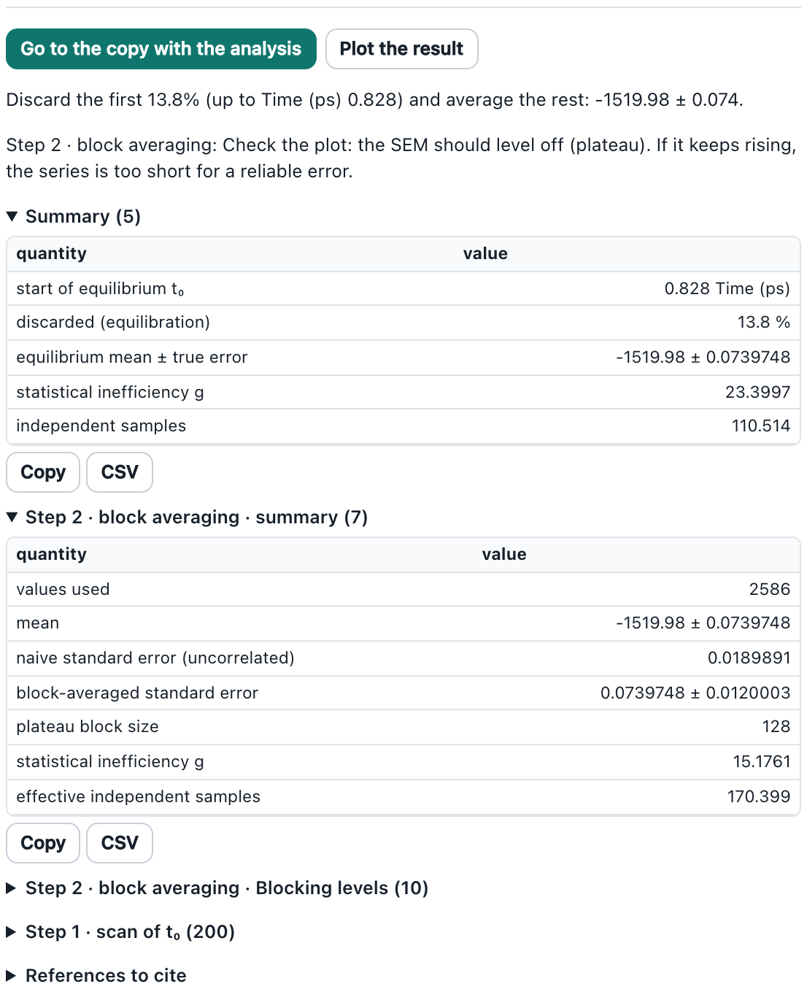

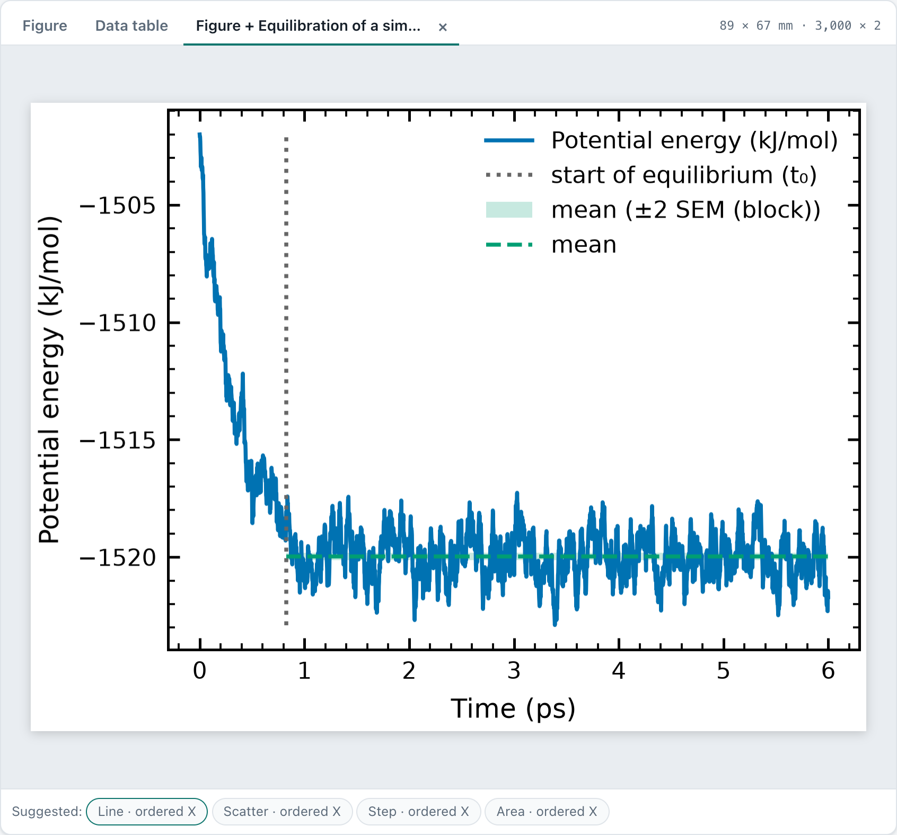

The start is chosen with the method of Chodera (2016): it keeps as many independent samples as possible.

#### Mean of a time series

**Mean of a time series (correlated data)** gives the mean with its true error, the correlation time and the number of independent samples. Use **Discard the first … %** to remove an equilibration period by hand.

#### Autocorrelation and block averaging

Consecutive points of a simulation or sensor log are **not independent**, so the usual error of the mean (SD/√N) is far too small.

* **Autocorrelation (ACF / PACF)** (rows must be equally spaced) draws the ACF with its confidence band and gives the integrated correlation time τ, the **statistical inefficiency** *g* and the **effective number of samples** N/g.

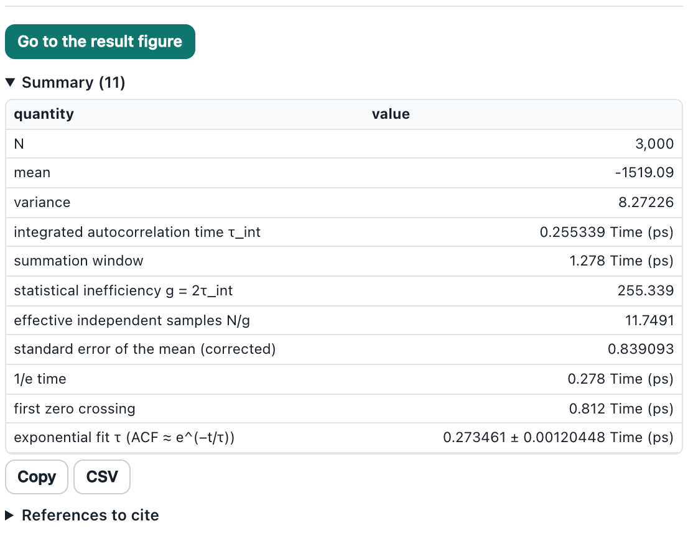

, the 95 % band (dashed) and the exponential fit of the initial decay (dotted). It opens as its own figure, in a tab with × to close it.")

* **Block averaging (error of correlated data)** (Flyvbjerg–Petersen) shows how the error estimate grows with the block size and levels off at the true error. If the curve does not reach a plateau, the series is too short.
* **Cross-correlation** compares two series as a function of the lag and finds the delay of best match.

### 5.7 Statistics

#### Gaussian distribution of a column

The recipe **Gaussian distribution of a column** draws the histogram, fits a Gaussian, checks the normality and gives the mean, σ and FWHM and the **true error of the mean**. **Rows are a time series** is ticked by default, so that the error of the mean is corrected for correlated values; untick it for independent measurements.

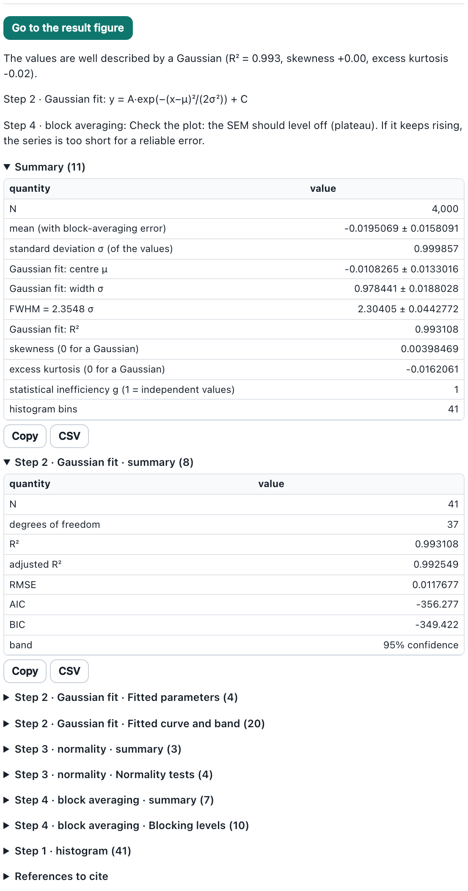

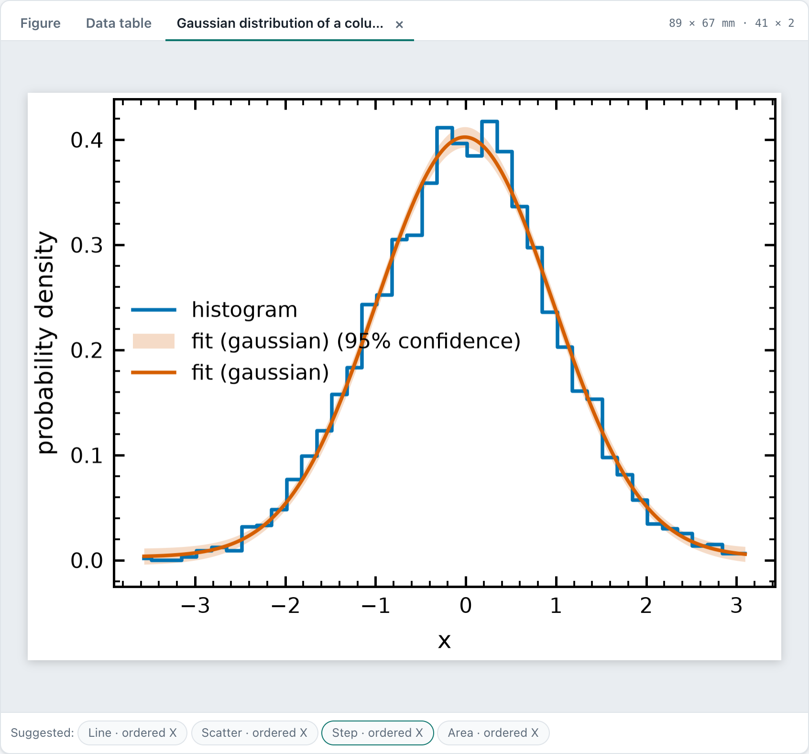

#### Are the groups different?

Open the **Groups** example, choose **Box** as plot type and the recipe **Are the groups different?** with the *Values* and *Group* columns. The right test is chosen **automatically**: each group is checked for normality (Shapiro–Wilk), then a Welch t-test (two groups) or a one-way ANOVA with Tukey HSD is used, or, if the data are not compatible with a normal distribution, Mann–Whitney or Kruskal–Wallis. The answer is written in plain words, with effect size and pairwise comparisons.

”, the test chosen, the effect size, per-group statistics and the pairwise table.")

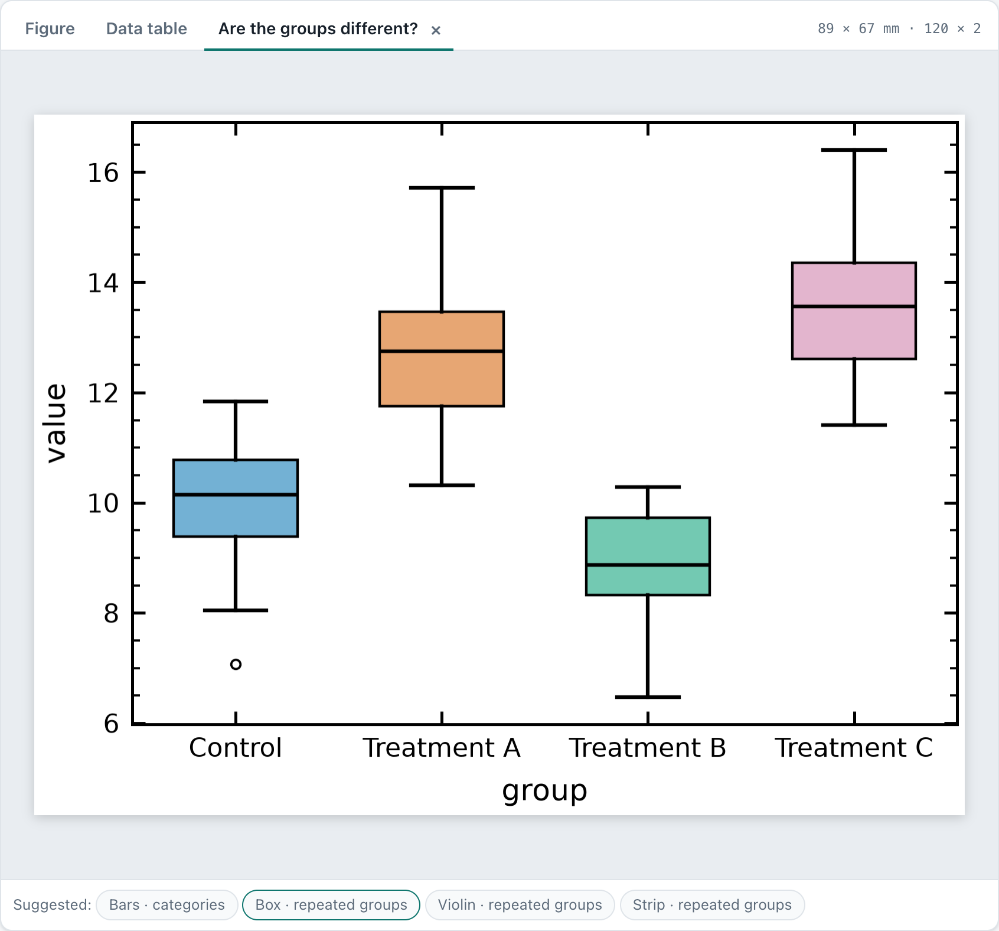

For full control use **Compare groups (t-test, ANOVA…)**: t-tests, Mann–Whitney, Wilcoxon, ANOVA, Alexander–Govern, Kruskal–Wallis, Tukey HSD and effect sizes.

#### Relation between two variables

The recipe **Relation between two variables** gives the correlation (Pearson and Spearman, with p-values), a straight-line fit with its confidence band and a check of the residuals.

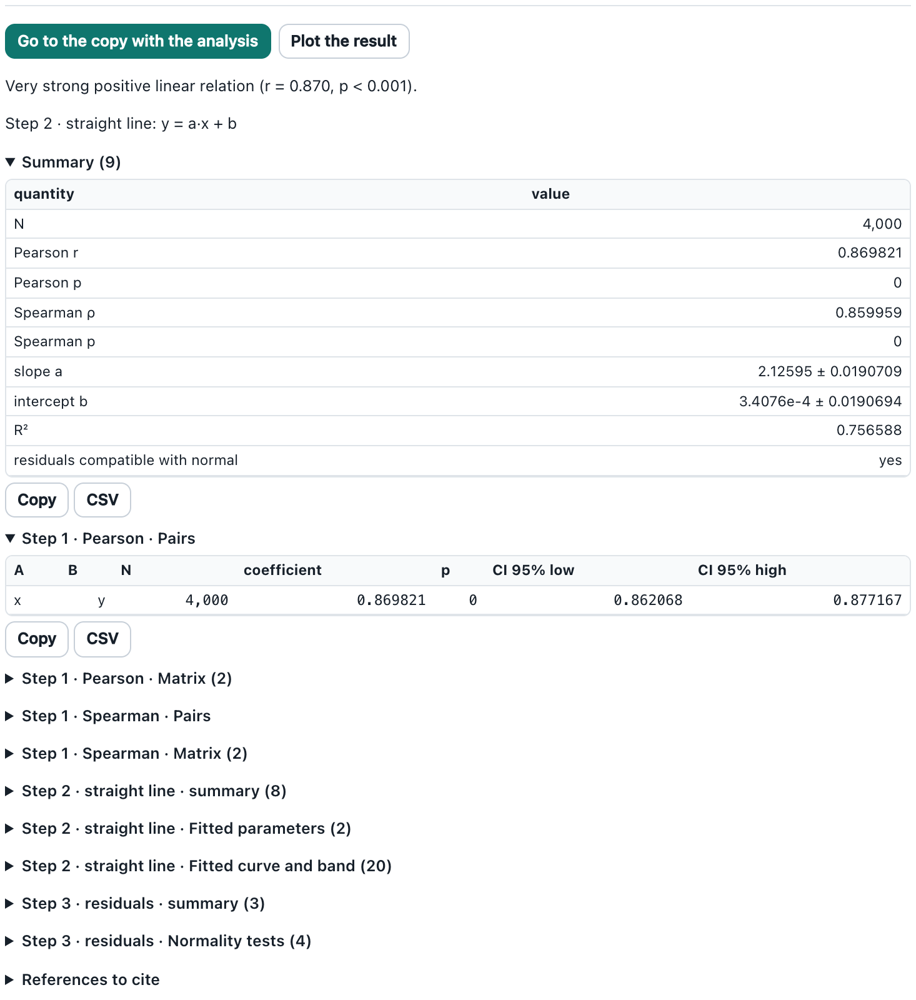

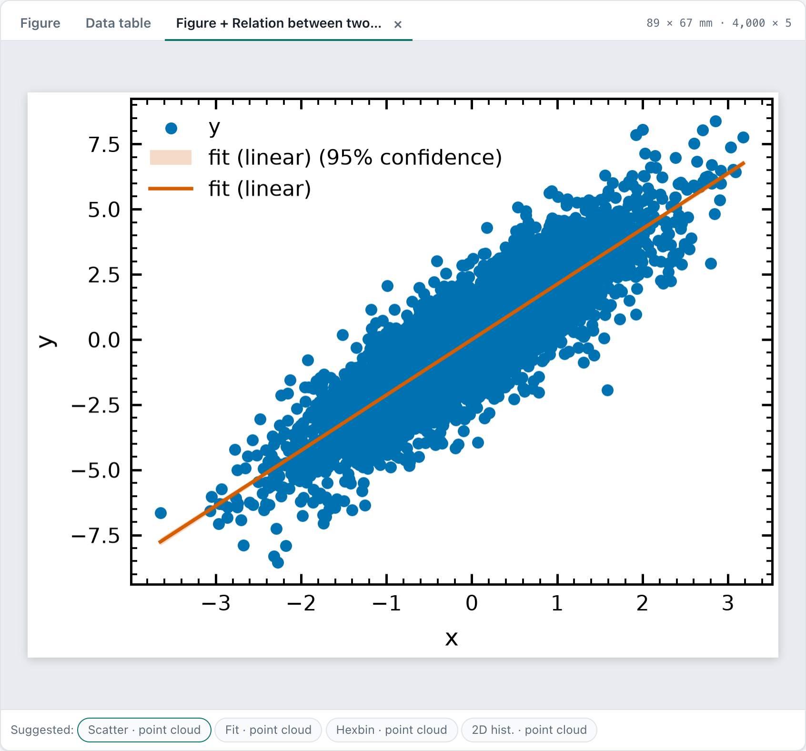

#### The single analyses

| Analysis | Use it to… |
|---|---|
| **Descriptive statistics** | N, mean, SD, SEM, confidence interval, median, quartiles, skewness, kurtosis; also split by a group column. |
| **Normality tests & Q–Q plot** | Check whether a sample is compatible with a normal distribution (four tests and a Q–Q plot). |
| **Correlation** | Correlation matrix (Pearson, Spearman, Kendall) with p-values and confidence intervals. |
| **Linear regression & ANOVA** | Ordinary least squares with one or more predictors or a formula such as `y ~ x + C(group)`; coefficients, p-values, R², AIC, ANOVA table and diagnostics. |
| **Distribution fitting** | Maximum-likelihood fit of several distributions; the best one by AIC; histogram with the densities. |
| **Smoothing & derivative** | Savitzky–Golay (with 1st / 2nd derivative), moving average or Gaussian filter. |
| **Power spectrum** | Frequency content of an equally spaced signal (FFT or Welch) and its dominant frequencies. |

## 6. Step 5 — Export

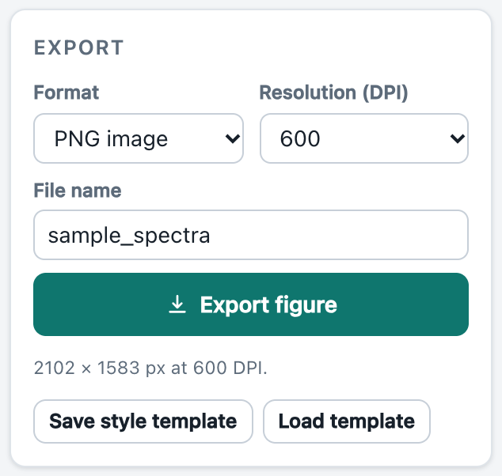

1. Choose the **Format**:
  - **PNG**, **TIFF (LZW, for journals)**, **JPEG** — raster images at 150, 300, 600 or 1200 **DPI**;
  - **PDF**, **SVG**, **EPS** — vector formats; the text stays editable (fonts are embedded as TrueType);
  - **Interactive HTML** — a page made with Plotly (zoom, hover) that opens in any browser;
  - **Python script (.zip)** — the data, the settings, a script and the references: it **recreates the figure without π-plotter** (`python make_figure.py`).
2. Type a **File name**.
3. Press **Export figure**. The file goes to the downloads folder of your browser.

The line under the button tells the size: for instance *1050 × 790 px at 300 DPI*, or *Vector format: sharp at any size*.

> **Tip:** the exported figure has exactly the physical size you chose in *Size & layout*. A copy with analysis curves is exported like any other figure: select its tab first.

### Citing

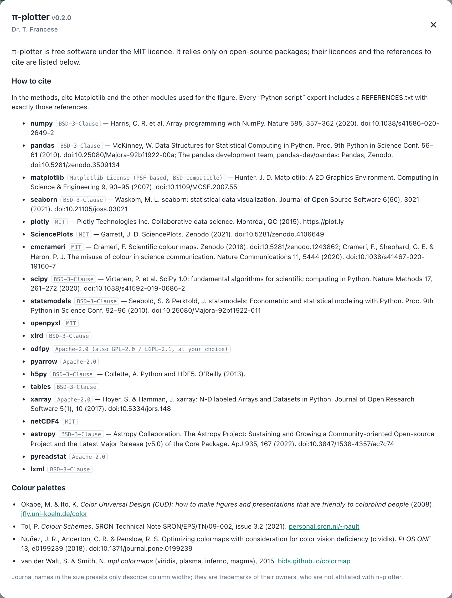

In the methods of your paper cite Matplotlib and the other modules used for the figure. The **ⓘ** button lists every module with its licence and the reference to cite, and every *Python script* export includes a `REFERENCES.txt` with exactly those references. Analysis results show the references of the methods they used.

## 7. Plugins and modules

### 7.1 Your own analyses (plugins)

Every analysis is a small Python plugin. At the bottom of the *Analysis* card:

* **Customise…** (next to the description of a built-in analysis) opens an editable copy of it;
* **New plugin** asks for a name and opens a template;
* **Plugins folder** opens the folder where your plugins live (`~/.piplotter/plugins/`), which survives updates;
* **⟳** reloads the plugins after you edited a file elsewhere.

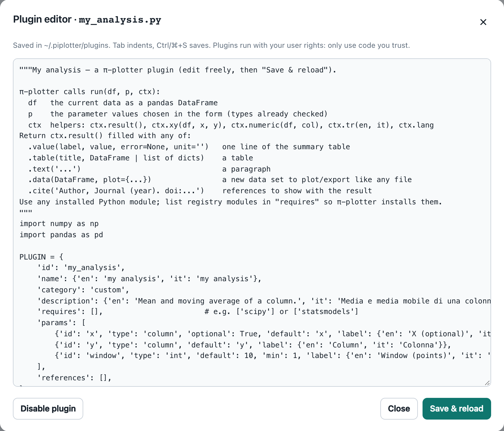

A plugin declares its parameters in a `PLUGIN` dictionary and implements `run(df, p, ctx)`. Write what you want to show with `ctx.result()` (values, tables, text, references, a data set to plot). The full guide, with examples, is in `PLUGINS.md`.

> **Warning:** plugins are Python code running with your user rights. Install only plugins you trust.

### 7.2 Python modules

The **Modules** button lists every module π-plotter can use, with its licence and the installed version.

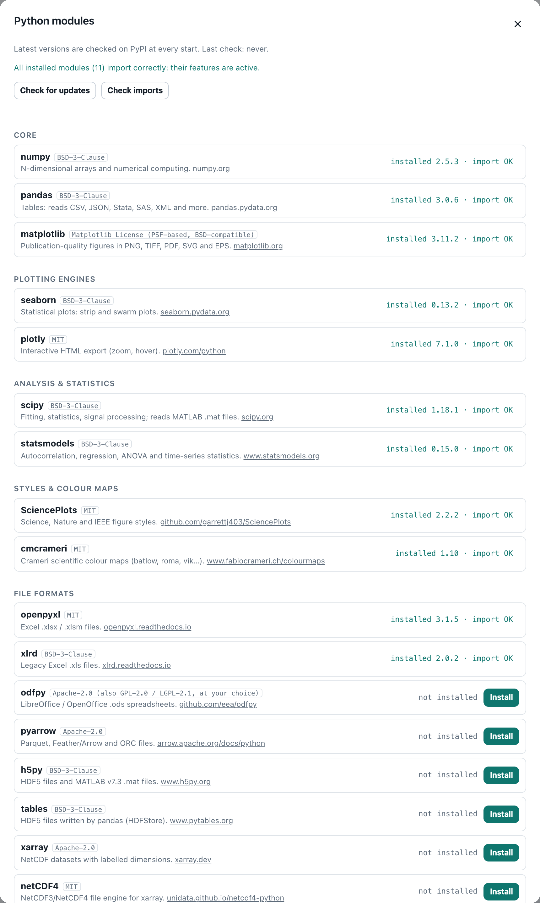

* At every start the program checks PyPI for newer versions (*Check for updates*; **Update all** with one click). Missing modules are offered when a feature needs them.
* **Check imports** loads each module in a separate Python: one that cannot be loaded is shown in red with its error and a **Reinstall** button.
* **Your modules (from PyPI)**: type the name of any package, press **Check**; π-plotter asks pip what it would install (nothing changes yet) and shows each package with its **licence**. Open-source licences install normally; any other licence needs a tick in *“I have read the licence terms…”*. After installing, the module is imported **with its submodules**; if it cannot be used it is **removed again** together with what came with it, and you see why. A module that imports is available to plugins; its icon appears at the end of the plot-type bar, listing its functions.

> **Warning:** modules you add are third-party code that π-plotter does not check. Install only what you trust. The licence check reads the package metadata; it is a help, not legal advice.

## 8. Questions and problems

| Problem | What to do |
|---|---|
| The page says the service does not respond | The terminal window was closed. Start π-plotter again. |
| *“This page belongs to another π-plotter session or version”* | Press **Reload** in the red bar. |
| A file opens with one column or strange numbers | Open **Import options** and choose the separator and decimal mark. |
| The figure shows columns I did not want | Untick them in **Y axis** (and check that X is not ticked). |
| The baseline cuts into the signal or follows the peaks | Use the default *straight line under the signal* (Shape 0 or 1), check **The peaks point** (up or down), or click anchor points where the signal is on its baseline. |
| A fit does not converge or gives silly values | Give **Starting values** and **Limits**, restrict **Fit from / up to**, or try a simpler model. |
| Peaks are missed or noise is marked as peaks | Change **Minimum prominence**; subtract a baseline first. |
| A module shows red in *Modules* | Press **Reinstall**; the reason is shown under the name. |
| After updating modules the program asks to restart | Press **Restart now**. |

Errors are also printed in the terminal window.

## 9. About this manual

This manual is part of the program: the text is the file `manual/MANUAL.md`, the pictures are in `manual/img/`, and the program shows them at **Manual** (`/manual`).

**To update the text**, edit `manual/MANUAL.md`. It uses a small subset of Markdown: headings (`##`, `###`), paragraphs, lists, tables, `> **Tip:**` / `**Note:**` / `**Warning:**` / `**Important:**` boxes, `` for pictures, `**bold**`, `*italic*`, `` `code` `` and `[links](url)`. Restart is not needed: reload the page.

**To redraw the pictures** after the interface or an analysis changes:

```
pip install playwright
.venv/bin/python tools/make_manual_images.py
```

The tool starts its own copy of π-plotter (with a temporary state folder, so your plugins and modules are not touched), drives it in a headless Chrome in English and in light mode, and saves every picture. `--only fit,ir` redraws just those; to add a picture write a function with `@shot('name')` in the tool and refer to `img/name.png` here. The numbers in the text that come from the examples (for instance τ ≈ 14 min) should be checked after redrawing.

### Revision history

| Version | Changes to the manual |
|---|---|
| 0.2.1 | Baseline: the new default (straight line under the signal), peaks pointing down (transmittance), clicked anchor points keep their y. |
| 0.2.0 | First edition: starting, data, plotting, figure style, zoom and 3D, analyses (fitting, kinetics, baseline and peaks, IR assignment, simulations, statistics), export, plugins and modules. |
